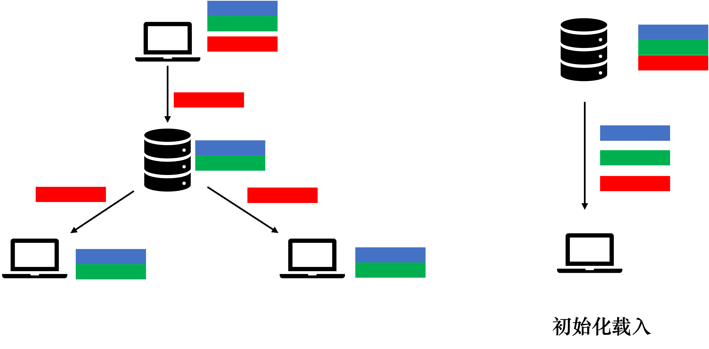

# 在线协作编辑文档——syDoc
该仓库目前即为FinalRelease

## 功能
* 文档编辑：编辑文本、图片、表格
* 在线协作：多人同时在线协作进行文档编辑
* 团队管理：增减团队成员，并进行权限管理
* 网络故障处理：网络无法连接至服务器时能及时提醒，并在网络恢复时重新同步
* 生成PDF文件
* 提供内置模板，导出excel表格，云端部署

## 技术栈
* 前端：
  * 框架: Vue
  * 富文本编辑器组件：[Quill](https://quilljs.com/)
  * 表格组件：[Luckysheet](https://mengshukeji.github.io/LuckysheetDocs/zh/)
* 后端：
  * 框架：Spring Boot
  * O-R映射：Hibernet
* 数据库：
  * 关系型数据库：mysql
  * 文档型数据库： mongoDB
* 网络：
  * Axios
  * Websocket
  
## 协同编辑性能测试（串行脚本）
* 本地端（Apple M1 Pro 10核 16GB）：
  * 3个文档同时编辑，每个文档为5人协作编辑——响应时间 25ms
  * 10个文档同时编辑，每个文档为10人协作编辑——响应时间 66ms
* 云端(阿里云ECS服务器 2核 4GB 3Mbps)：
3个文档同时编辑，每个文档为5人协作编辑——响应时间 99ms

## 协同编辑原理
* 核心思路：优先提升消息转发速度
* 增量式消息转发
  * 先转发后写数据库
  * 初始化时载入所有操作记录
* 特点：牺牲部分初始读取速度，大幅提高协同编辑性能，方便后续历史记录功能扩展
 

## 网络故障检测
* 检测网络中断：心跳机制
  * 每秒向云端发送http请求，无响应则认为网络中断
* 自动重连：
  * 每秒向云端发送请求，收到心跳后重新建立WebSocket连接

## 未完成功能
* 不一致性解决算法设计
  * 文档：后端对增量操作进行编号
  * 表格：编辑单元格前需拿锁
* 历史记录显示与回溯

## 成员贡献
* 倪祯旸：
  * 核心算法设计：消息转发，心跳检测
  * 后端：Websocket 转发，MongoDB读写，云端部署
  * 前端：Quill , Luckysheet
  * 转发性能测试
* 刘容川：
  * 后端：账号，文档，权限控制，MySQL读写
  * 前端：界面美化
* 林雨萱：
  * 前端：账号登陆，注册，文档管理，权限管理，LuckySheet
  * 网络：Axios请求发送, 网络故障检测
* 沈钰婷：
  * 前端： Quill，导出PDF,文档模板
  * 网络：WebSocket请求发送
* 辛惟承：
  * 前端界面
  * 代码测试
  * 设计图

